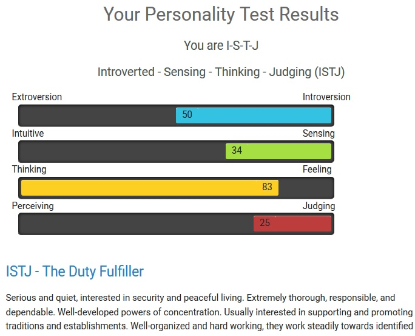
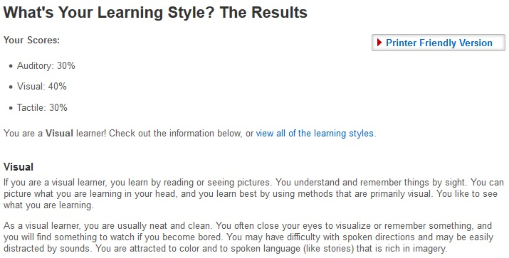
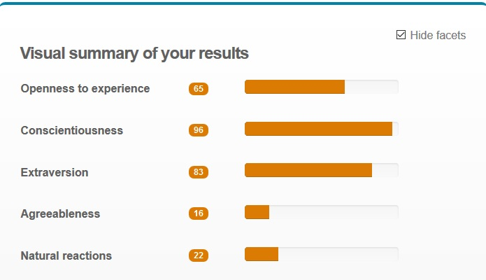
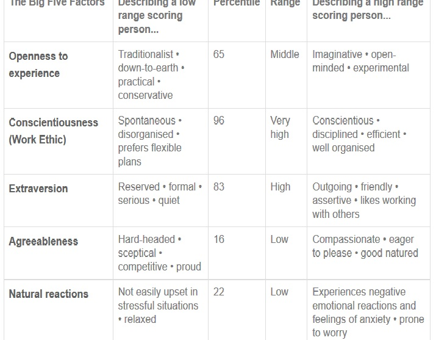

## Introduction:
- Name:         Dane Callaghan
- Student#:     s3731871
- Email:        s3731871@student.rmit.edu.au
- Nationality:  Australian
- Culture:      I think this is hard to define, as it's probably a combination of many.
- Languages:    English. I do have an interest in learning more, and am currently teaching myself German and Brazillian Portuguese.
- Interesting Fact: One of my hobbies is skydiving. I have done 131 jumps so far and hope to one day reach 1000.

## Education:
Completed Year 10 at high school.  
Cert III in Electrotechnology.  
Cert IV in Electrical Equipment in Hazardous Areas.  
Completed 1st year of Bachelor of IT in 2009, then had to postpone.  
Diploma of Financial Planning.  
Currently studying a Bachelor of Business (Financial Planning).  

## Background:
I moved from highschool straight into my electrical apprenticeship. For around 20 years I worked in the electrical/construction industry in various working environments. I worked on basic residential dwellings all the way through to billion dollar mining projects.    
Mid 2017 I decided to commit fully to a career change. I put myself through a DFP, then progressed onto my current degree - Bbus (FP). I am currently working as an Associate Adviser for a financial planning firm.

## My Interest In IT:
My earliest memories of "IT" are visiting the local Penny Arcade, which is the 1980's equivalent of Timezone. I was exposed to video games at a young age and became hooked. I got my first console at around 10 years old, which was the original Nintendo Entertainment System.  
I always seemed to have an interest in various technologies growing up, and was exposed to computing early as my mother taught computer literacy, database design and programming at Tafe.  
In 2009, I was dissatisfied with my job as an electrician and commenced at Bachelor of IT thruogh Griffith. I completed my first year then life circumstances got in the way and I postponed it with a view to complete at a later date. That was my first "real" deep exposure to what IT was. I loved it, and my results weren't bad considering I had no real actual experience previously.  

RMIT was chosen by default, although I am more than happy to be studying through them. My degree is offered online through them, although it's made up of many other university's modules too. The structure of my degree is that RMIT will issue it if I complete at least 8 core units through them.    

My expectations of this course are that I will receive a better overall understanding of what IT is, and how it applies to today's work environment. I am hoping it will help develop my IT knowledge, communication skills and help me identify ways in which IT can compliment my life.  

## Ideal Job:

I have recently moved into the financial planning industry. Currently my ideal job is to be a financial adviser, with the hope of one day moving into a management or mentor type role. As such, the job posting below reflects my desire for that kind of position.  

  

  
 
The job posting can be viewed on Seek [here](https://www.seek.com.au/job/38381422?searchrequesttoken=935c9592-fd12-4cb6-adda-25411837db7c&type=promoted)  

## Description:
A Senior Financial Adviser works with clients to help them understand their financial needs. They discuss and assesss various aspects of the clients financial situation such as budgets and cash flow, superannuation, investments, risk management, estate planning and retirement goals. The adviser will help educate the client on these topics and address any concerns they may have. 

After assessment, the adviser will build a strategy tailored to the client's specific needs and goals. The adviser then implements the financial plan and monitors it to ensure it continues to meet the client's goals as their life moves forward.  

Being a financial adviser is appealing to me as it is a people focused position. This job will allow me to engage with people and truly make a difference in their life. I also find the research invloved interesting and it's satisfying developing a plan based on the client's individual needs.  

## Required Skills:
 - Communication Skills. The adviser needs to listen and understand the clients needs, and be able to convey information to the client  
 - Research Skills. Adviser need an ability to look at the client's situation, and research appropraite products and strategy to ensure the client's objectives are met.
 - Time Management. An adviser needs to be organised to deliver the advice in a timely manner.  
 - IT Skills. Adviser need a working knowledge of various compluter applications such as Word, Excel, Outlook, CRMs and other IT related equipment.
 - Before December 31 last year, advisers could have a minimum of a Diploma of Financial Planning and legally be allowed to give advice. This was limited to their skill level, as advisers can't give advice on anything they don't have experience with. Following the Royal Comission, the standards for formal education have now changed. By 2024 advisers will be required to have a related degree such as economics, business (financial major) or commerce and complete bridging courses as required. There is also an option for previously registered advisers to complete a Graduate Diploma of 8 subjects if they don't have a related degree.
 
## My Current Skills:
 
 - Communication skills. Developed through my professional career and currently being refined in a financial planning support role.  
 - Research Skills. Developed through various levels of study.  
 - Time Management. My current job requires me to have an exceptional level of time management skills.  
 - Diploma of Financial Planning.  
 - Currently studying a Bachelor of Business (Financial Planning).  
 
 I plan to build on these skills by completeing my degree, on the job experience and continuing to develope my knowledge through research. Part of being an adviser requires continual study which is recognised through CPD point. CPD stands for Compulsory Personal Development. This helps ensure that advisers stay up to date with the ever changing financial services world.
 
## Personal Profile:
 
 Below are the my personal results from profiling tests. These tests are designed to assess personality and learning types of the individual.
 
## Myers Briggs Type Test:

## Learning Style Test:

  

## Big 5 Personality Test:

 
         

## What These Results Mean For Me:

I think these test results are somewhat true, although I disagree with parts of them. In regards to the Myers-Briggs type test, while I am serious, I am certainly not quiet (just ask my girlfriend!). I like to think I am thorough and dependable. When I am in a team, I definitely don't want to let anyone down and pride myself on doing more than just "my part". I think my score of 83 in the Thinking section of the test shows that I lean towards critical think and analysis ore than my "gut feeling". I am very process driven and like to see the logical reasons of why I do things. I interpret my 50% split of introversion/extraversion to mean that once I feel comfortable, I am quite outgoing. I tend to "sus out" people before I give them them the full me.  

In regards to my learning style result, this could not be more true. In my work I will often get someone to show me a task, then I will make myself a visual guide to follow. I also often use Youtube as a learning guide as things tend to click better for me when I see them. I find it difficult to learn if it's just from people telling me.  

The Big 5 Personality result describes me quite well. I believe I have a very strong work ethic, and make a conscious effort to develop team relationships. The low score in my agreeableness can sometimes be an issue as if I don't agree on something, and you can't present me logical facts to support your opinion it's very hard to change my mind. I think I have a healthy mix in the Openness to Experience section. I like to follow traditional methods, but am always open to a better or more efficient way of doing things.  

## How These Results May Influence My Behaviour In A Team:

I think I would work well in a team, and would expect we had a solid plan where everyone knew exactly what is expected from them. I would want a clear timeline established, with defined tasks set out to be completed in that time. I have sometimes been described as "too picky" as I can scrutinise every detail. The positive side to that is that I am very thorough if assigned a research task.

## Things to consider when I form a team:

I think personality cetainly plays a part in forming a team, and that it can be beneficial to have a mix of diffeent types. It is important to know everyone's skills, learning methods and how they work best. If we can understand the various types of personalities, we can understand how best to interact with each type. 

## Project Idea:

## Overview

My project idea was actually conceived in 2013 while on holiday in Canada with my girlfriend. It was a Sunday afternoon, and we were looking for a place to go for a drink/food with live music. We had a hard time searching for anywhere, and we didn’t really know the city (Toronto). After an hour or two of wandering aimlessly we finally found a place.  

I thought to myself “That was incredibly frustrating”, and said to my girlfriend “Imagine if there was an app, similar to Uber that took your location and suggested places to go based your profile or search criteria. 
Ultimately, we wanted an app that would tell us what’s on and where to go in minutes.  

## Motivation  

We were frustrated. We spent a couple of hours trying to google venues and gig guides and hopped in and out of various business pages trying to find somewhere. We walked to a few of them and they were either closed, or not what we were looking for. That sparked our initial discussion and we ended up searching to see if any app like that existed.  

Fast forward six years to 2019, and I still can’t find an app that will serve this purpose. On the website www.statista.com, they report that billions of dollars are spent annually on live music and billions more in the hospitality industry. 
Following the success of businesses like Uber and AirBnb, which essentially provide a connection between consumer and provider, I imagined the possibility of providing a similar service to the consumer for entertainment.  

## Description  

The app will allow users to set up a personalised profile that reflects their age, entertainment tastes such as music/theatre etc, culinary tastes, price ranges, willingness to travel and other variables. Based off those inputs, the app will then use their location and link/display available entertainment options.  

For example, say you’re in a new city for the first time. You are looking to go out but don’t have any “local” knowledge. You open the app, check a few options and you are then instantly connected to entertainment matches in your area. You can then use the app to connect with Uber/hotels/ticket vendors and start planning your night out.  

In a similar ideology to Uber and AirBnb, users could then rate the venue/restaurant/gig etc which would then provide further analytical tools for the community. The idea is that there will be a centralised app that connects consumers to entertainment providers. You could also have a “friends” system that would allow users to see what their friends are doing or invite their friends to attend with them.
Revenue could be generated by using user data to show them advertising based on the activity history. If a user frequently searched for sporting events, the user could be shown a higher percentage of similar events or offered deals that would encourage them to attend more.  

There could also be a point type system, whereby users would be rewarded for attending events and leaving a review. Other actions such as referring friends, or linking services such as Uber would accumulate points which could then be redeemed for discounts, free trips or other deals.  

Ideally the app/service would be free, and would be funded by advertising shown to the users. Businesses could pay for premium accounts in which users could be specifically targeted for advertising (in a similar method to facebook).
Tools and Technologies
The product and service would centre around the users mobile app. The app would need to include the following list of technologies.
-	Mapping and location identification. Similarly to Uber the app would need to be able to locate the user, identify services within a certain radius and provide transport options to get there. 
-	Local transport integration. The app would need to identify local transport services such as buses, trains, taxis and of course link to ridesharing apps like Uber
-	Notification system. The app would need an ability to notify users if they are close to events that match their profile or interests. It will also need to notify them if their friends are going to events etc and could also notify them of their point status
-	Integration with payment systems. Users would need to be able to pay via apps like paypal or card processing technologies.
-	Hardware/servers and data processing. The service would need the hardware and backend technology to run the app.  

## Skills Required
Building and developing everything involved to make this successful would require various knowledge in the following areas:
-	Software development
-	Network development and maintenance
-	Server and data processing
-	Algorithm development for linking purposes
-	Marketing expertise
-	Advertising Expertise
-	Design expertise – in regards to user friendly and intuitive GUI etc
-	Integration knowledge – The app would need to integrate with sites such as google maps, entertainment sites, databases, transport sites, ticketing sites  

I think finding the skills, software and hardware required would be feasible, but it would also come at a cost. I think the fact that similar technology is already in use for services such as Uber indicates that it’s definitely possible.  

## Outcome  

If the project was successful, it could definitely provide a solution to my original problem. I think the challenge would be convincing businesses to get on board initially. I think it could compliment existing services, and given that the entertainment industry has billions of dollars spent annually it could be profitable if marketed and implemented correctly.
It could change the way people interact with entertainment businesses. It may encourage more tourism, as it will be easier to access local information. It could help boost local economies if it was made easier for people to connect with businesses. 
It would also encourage more social interaction by use of the technology where a lot of the population is already interacting.  

## References:

- 123test.com, Personality test, accessed 16 March 2019, <https://www.123test.com/personality-test/id=fCJRSJOGMXGLOOY&version=>  

- http://www.educationplanner.org/students/self-assessments/learning-styles-quiz.shtml?event=results&A=6&V=8&T=6
- http://www.humanmetrics.com/cgi-win/jtypes2.asp
- https://personalityatwork.co
- https://www.quora.com/What-is-Ubers-server-architecture
- http://seek.com.au/

